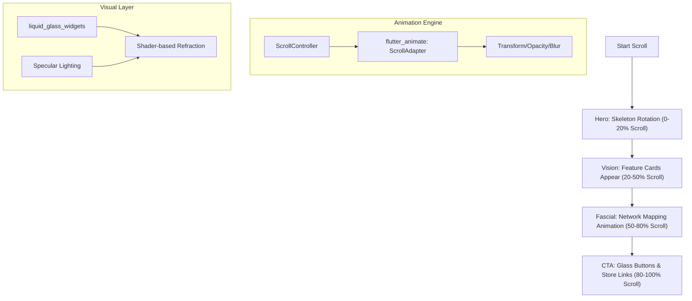

# Modification Design: Premium Bioliminal Landing Page

## Overview
This document outlines the redesign of the Bioliminal landing page from a basic informational site to a "premium, modern, and aesthetically pleasing" cinematic experience. The overhaul leverages **Dark Mode**, **Scroll-Driven Storytelling**, and high-fidelity assets to showcase the AI's precision and the clinical depth of the platform.

## Detailed Analysis
The current landing page lacks the visual "wow factor" and depth expected of a 2026 AI health tech product. To solve this, we will implement a design system based on **"Liquid Glass"** (Tactile Futurism) and use scroll-driven animations to guide the user through the Bioliminal value proposition.

### Key Objectives:
1.  **Aesthetic Overhaul:** Adopt a Deep Indigo/Slate dark mode with glowing accents and shader-based glassmorphism.
2.  **Scroll-Driven Storytelling:** Use the `flutter_animate` adapter pattern to trigger transformations, fades, and parallax effects as the user explores the page.
3.  **High-Fidelity Assets:** Integrate high-res 3D Hero visuals and stylized Fascial Chain networks (to be generated by the user).
4.  **Performance:** Maintain 60+ FPS on web using optimized rendering techniques (e.g., `RepaintBoundary`, sharing GPU backdrops).

## Alternatives Considered
-   **Video-Based Backgrounds:** *Rejected* due to bandwidth concerns and lack of interactivity. Scroll-driven Flutter animations provide a more responsive and lightweight "liquid" feel.
-   **Standard "Bento" Grid:** *Rejected* as the primary layout in favor of a linear storytelling flow, though Bento elements will be used within feature cards.

## Detailed Design

### 1. Visual Theme: "Liquid Glass"
-   **Base:** `BioliminalTheme.screenBackground` (Slate 900).
-   **Layers:** Multi-pass Gaussian blur cards with chromatic aberration refraction (using `liquid_glass_widgets`).
-   **Lighting:** "Specular Highlights" that shift based on scroll position, simulating a moving light source over the glass surfaces.

### 2. Storytelling Flow (Scroll-Driven)
Using a `CustomScrollView` with `Sliver` components:

1.  **The Origin (Hero):**
    -   A massive, glowing 3D skeleton (Hero Visual) enters from the dark.
    -   As the user scrolls, the skeleton rotates and "zooms" in, revealing the 33-landmark mesh.
    -   Typography: "REDEFINE MOVEMENT." fades out as "VISION BEYOND SIGHT." fades in.
2.  **The Sight (Feature Showcase):**
    -   Side-by-side comparison cards.
    -   Glass panels "wobble" (Jelly Physics) into view.
    -   Feature highlights (Pose, Kinetics, Feedback) animate their icons using `flutter_animate` triggered by the scroll position.
3.  **The Connection (Fascial Chains):**
    -   The skeleton transforms into a glowing network of lines (Fascial Chain Visualization).
    -   User scrolls to "trace" a specific line (e.g., the Lateral Line) from ankle to neck.
    -   Interactive "Hotspots" reveal clinical insights using frosted glass overlays.
4.  **The Trust (Clinical Logic):**
    -   Clean, minimalist section with bold, large-scale typography.
    -   "Rule-Based Engine" graphic that simplifies as you scroll, showing the "Logic Layer."

### 3. Technical Implementation
-   **Animations:** Use `flutter_animate` with `ScrollAdapter` for complex timeline-based transitions.
-   **Glass Effects:** Integrate `liquid_glass_widgets` for shader-based components.
-   **Asset Handling:** Placeholders will be used initially, with absolute paths for the `nano banana` generated high-res images.
-   **Optimization:** Wrap large sections in `RepaintBoundary` to prevent redundant painting of the complex glass shaders during high-frequency scroll updates.

### Diagrams

## Summary
The redesign transforms Bioliminal's web presence into an immersive, cinematic experience. By combining shader-based glassmorphism with physics-driven scroll animations, we create a "tactile futurism" aesthetic that builds trust and showcases the platform's technological superiority.

## References
- [Liquid Glass Design Language (iOS 26 Concept)](https://github.com/sdegenaar/liquid_glass_widgets)
- [Flutter Animate: Adapter Pattern](https://pub.dev/packages/flutter_animate)
- [Bioliminal Architecture (GEMINI.md)](./GEMINI.md)
