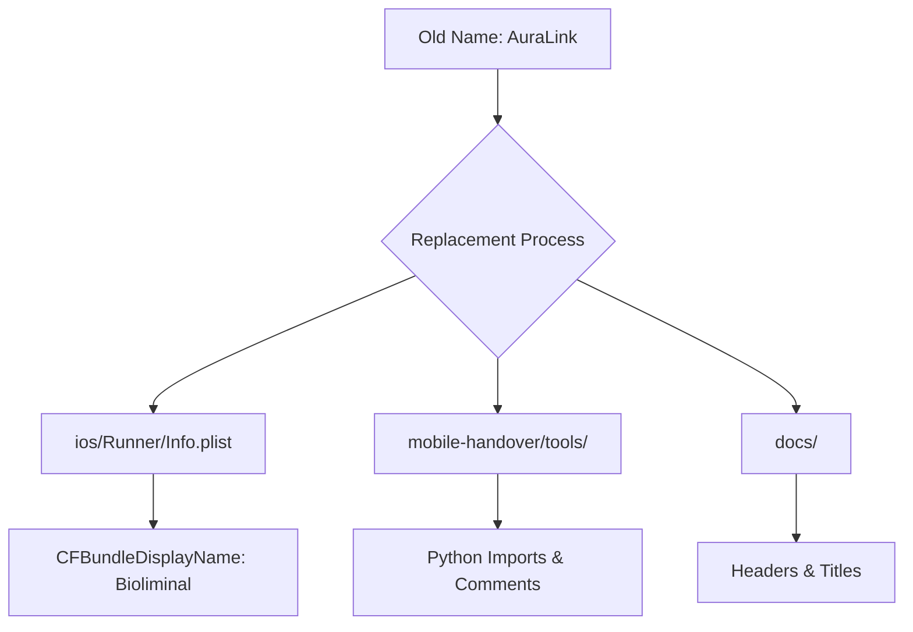

# Modification Design: Rename AuraLink to Bioliminal

## Overview
This modification aims to complete the rebranding of the project from "AuraLink" to "Bioliminal". While some parts of the codebase (like `pubspec.yaml` and `lib/main.dart`) have already been updated, several lingering references remain in platform-specific configurations, internal scripts, and documentation.

## Detailed Analysis
The project transition requires a surgical replacement of the old product name "AuraLink" with the new name "Bioliminal". This is not just a cosmetic change but also affects how the app is identified on mobile platforms (iOS Display Name) and how internal tools reference backend services.

### Identified Instances:
1.  **iOS `Info.plist`**: `CFBundleDisplayName` is still set to "Auralink".
2.  **Internal Scripts**: `mobile-handover/tools/export_schemas.py` and `mobile-handover/tools/post_sample.sh` reference `auralink` in comments and Python imports.
3.  **Documentation**: Several documents in `docs/` still use "AuraLink" in titles and headers.

## Alternatives Considered
-   **Manual Search and Replace**: Selected as the primary method due to the relatively low number of occurrences and the need for case-sensitive replacements.
-   **Automated Batch Script**: Considered but rejected to avoid unintended side effects in binary files or unrelated strings.

## Detailed Design
The replacement will follow these rules:
-   `auralink` -> `bioliminal`
-   `AuraLink` -> `Bioliminal`
-   `Auralink` -> `Bioliminal`

### Affected Files and Actions:

#### 1. iOS Configuration (`ios/Runner/Info.plist`)
-   Update `CFBundleDisplayName` from `<string>Auralink</string>` to `<string>Bioliminal</string>`.

#### 2. Mobile Handover Tools
-   `mobile-handover/tools/export_schemas.py`: Update documentation comments and the `from auralink.api.schemas import Session` import.
-   `mobile-handover/tools/post_sample.sh`: Update the smoke-test comment.

#### 3. Documentation
-   `docs/rajat's docs/wave1-lean-final.html`: Update `<title>` and `<h1>` tags.
-   `docs/rajat's docs/final-buy-list-with-local.md`: Update the main header.

## Diagrams

## Summary
The renaming process will ensure consistency across the entire project repository, aligning all platform configurations, scripts, and documentation with the "Bioliminal" brand identity.

## References
No external research was required as this is a project-specific renaming task based on user directive.
