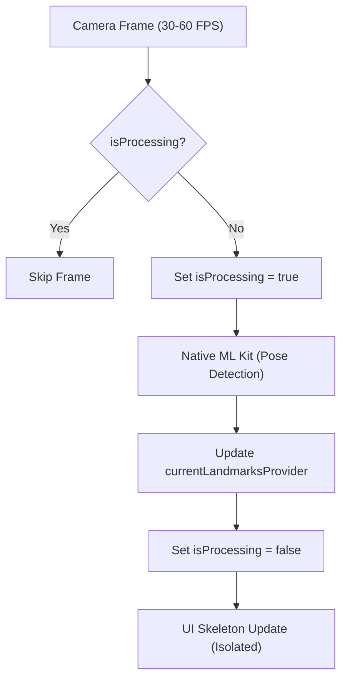
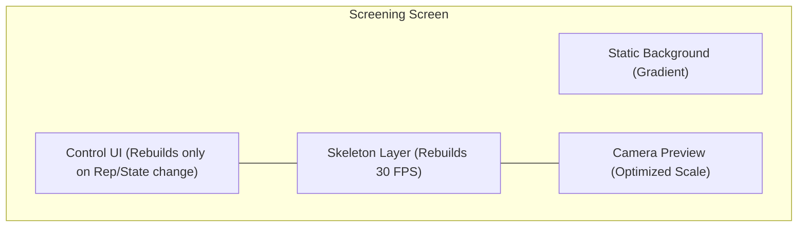

# DESIGN: AuraLink App Stabilization & Premium Overhaul

## Overview
AuraLink is an AI-powered movement screening app that bridges computer vision with fascial chain science. The current implementation suffers from performance bottlenecks (high GPU/CPU usage causing slowness), state management errors (crashes when cloud sync is disabled), and a UI that lacks a "premium" feel. This overhaul aims to stabilize the app, optimize the camera pipeline for high-FPS performance, and deliver a sophisticated, modern UI.

## Detailed Analysis

### 1. State Errors (Crashes)
- **Problem:** `AuthService` and `FirestoreService` providers are hardcoded to throw `StateError` if `cloudSyncEnabledProvider` is false.
- **Impact:** Any widget or service that watches these providers will crash the app upon build if the user hasn't explicitly opted into cloud sync.
- **Root Cause:** Aggressive error-throwing in the provider definition without UI-level guards.

### 2. Performance (Slowness & Lag)
- **Problem A: Camera Pipeline:** The `AppCameraController` cancels and recreates the pose estimation subscription on every frame.
- **Problem B: High-Frequency UI Rebuilds:** The `ScreeningView` and `SkeletonOverlay` are forced to rebuild the entire widget tree (including expensive `BackdropFilter` and `Stack` operations) at 30-60 FPS because they watch the raw landmark stream.
- **Problem C: Heavy UI Elements:** Extensive use of `BackdropFilter` for "glass" effects is GPU-intensive on mobile devices when combined with high-frequency rebuilds.

### 3. Wiring & UI
- **Problem:** Many features in `ReportView` and `HistoryView` (e.g., PDF export, archetype badges) are implemented as "dead code" or unused components. The navigation flow is incomplete in several places.

## Detailed Design

### 1. State Stabilization
- **Refactor Providers:** Modify `authServiceProvider` and `firestoreServiceProvider` to return `null` (or an `Option` type) instead of throwing errors.
- **UI Guards:** Implement `Consumer` widgets or provider `select` patterns that check for `null` before attempting to access cloud features.

### 2. Optimized Camera & AI Pipeline
- **Busy-Flag Pattern:** Implement a persistent stream in `AppCameraController`. Use a `_isProcessing` boolean to skip incoming frames if the previous frame's pose estimation is still in flight.
- **Isolate-Based Landmarks:** (Optional/Future) Offload landmark smoothing to a background isolate if Dart-side jitter is observed.

### 3. High-Performance Premium UI
- **Rebuild Isolation:** 
  - Use Riverpod's `select` to ensure widgets only rebuild when specific fields (e.g., `repsCompleted`) change, rather than on every landmark update.
  - Separate the `SkeletonOverlay` into its own layer so the background and header/footer widgets don't rebuild on every frame.
- **Optimized Glassmorphism:**
  - Use `BackdropFilter` sparingly. For static elements, use pre-rendered semi-transparent gradients or "glass" textures.
  - Group expensive filters into a single `RepaintBoundary`.
- **Sophisticated Aesthetics:**
  - **Color Palette:** Deep navy/slate backgrounds (`#0F172A`) with vibrant secondary accents (AuraLink secondary color).
  - **Typography:** Refined use of `labelSmall` and `headlineLarge` from the theme to create a clinical yet modern feel.

### 4. Wiring & Feature Completion
- **Report View:** Fully wire the `PDFGenerator` and `SharePlus` integration.
- **History View:** Integrate the `ArchetypeClassifier` and `TrendDetectionService` results into the history cards.

## Diagrams

### Optimized Camera Pipeline (Mermaid)

### UI Rebuild Layering (Mermaid)

## Summary
The overhaul focuses on **decoupling high-frequency AI data from the heavy UI tree**. By stabilizing the state providers and optimizing the camera stream processing, we will eliminate crashes and lag. The "premium" feel will be achieved through surgical UI updates that prioritize smoothness and sophisticated design over computationally expensive filters.

## References
- [Flutter Camera Stream Optimization](https://pub.dev/packages/camera)
- [Riverpod Performance Best Practices](https://riverpod.dev/docs/concepts/modifiers/select)
- [Glassmorphism in Flutter Performance](https://api.flutter.dev/flutter/widgets/BackdropFilter-class.html)
