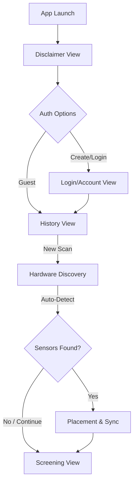

# Modification Design: Initial Flow Realignment & Hardware Discovery

## Overview
This document outlines the realignment of the Bioliminal application flow to integrate a modern authentication experience and an optional, low-friction hardware discovery process. The goal is to minimize cognitive load while ensuring that high-fidelity sEMG sensors are discoverable by all users without being a mandatory roadblock.

## Detailed Analysis
### Current Flow
1. **Disclaimer**: Educational slides that lead directly to Hardware Setup.
2. **Hardware Setup**: A multi-step flow that assumes hardware usage is the default path.
3. **Login**: Tucked away in Settings as "Enable Cloud Sync", not part of the initial onboarding.

### Desired Flow
1. **Disclaimer**: Retain the FDA-mandated educational/legal context.
2. **Auth Options**: A new screen providing three clear paths:
   - **Create Account**: Full cloud-sync registration.
   - **Login**: For returning users.
   - **Continue without account**: Low-friction "Guest Mode" (Local-only).
3. **Main App (History)**: The landing zone for all users.
4. **Hardware Discovery (Pre-flight)**:
   - Triggered when starting a "New Scan".
   - Automatically searches for Bioliminal sensors in the background.
   - Provides a "CONTINUE WITHOUT SENSORS" option immediately to prevent stalling.

## Alternatives Considered
- **Mandatory Hardware Selection**: Asking the user "What sensors do you have?" during onboarding. *Rejected* as it increases cognitive load for users who just want to try the vision-only feature.
- **Always-on Background Scanning**: Scanning for sensors globally throughout the app. *Rejected* due to battery drain and privacy concerns; scanning should only occur when intent to screen is established.

## Detailed Design

### 1. Navigation Realignment
The `GoRouter` configuration in `lib/core/router.dart` will be updated:
- `/disclaimer` -> `/auth-options`
- `/auth-options` -> `/history` (if Guest) or `/login`
- `/history` -> `/hardware-setup` -> `/screening`

### 2. New Views
- **AuthOptionsView**: A high-impact branding screen with three buttons.
  - "CREATE ACCOUNT" (Primary)
  - "LOG IN" (Secondary)
  - "CONTINUE WITHOUT ACCOUNT" (Tertiary/Link style)

### 3. Hardware Discovery Refactor
The `HardwareSetupView` will be modified to act as an automated discovery hub:
- **Auto-Scan**: `onInit` equivalent in Riverpod will trigger the BLE scan immediately.
- **Simplified UI**: A "Searching for Bioliminal Sensors..." pulse animation.
- **Phrasing**: All "SKIP" text will be replaced with "CONTINUE WITHOUT SENSORS".
- **Conditional Steps**: If no sensors are found within ~5 seconds, the "CONTINUE WITHOUT SENSORS" button will be highlighted to guide the user forward.

### Diagrams

## Summary
The realignment transforms Bioliminal from a hardware-first utility into an accessible, tiered movement platform. By deferring hardware checks until the moment of screening and providing a clear "Continue without sensors" path, we maintain the professional utility of the app while drastically lowering the entry barrier for new users.

## References
- [Google Material Design: Progressive Disclosure](https://m3.material.io/foundations/progressive-disclosure)
- [Bioliminal Architecture (GEMINI.md)](./GEMINI.md)
