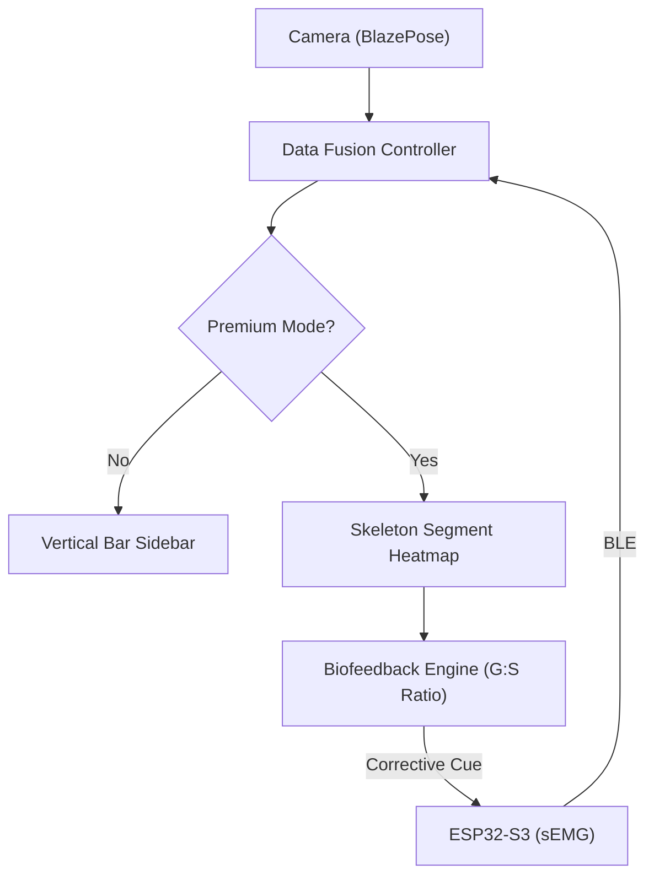

# DESIGN: Bioliminal Rebrand & Hardware Integration

## Overview
This modification transitions the Bioliminal project to its final identity: **Bioliminal**. Beyond rebranding, it integrates 10-channel surface Electromyography (sEMG) data via Bluetooth Low Energy (BLE) from an ESP32-S3 hardware hub. It also introduces a "Premium" tier focused on real-time biofeedback and anatomical heatmapping.

## Detailed Analysis

### 1. Project-Wide Rebranding (Bioliminal)
- **Package Rename:** `package:bioliminal/` becomes `package:bioliminal/`. This involves a deep refactor of all import statements and the `pubspec.yaml` configuration.
- **Visual Identity:** Transition from clinical blue to the Bioliminal palette:
  - **Primary:** Deep Slate (`#0A0A0F`)
  - **Secondary/sEMG:** Aqua (`#00D4AA`)
  - **TSA Squeeze/Accent:** Orange (`#FF6B35`)
- **Strings:** All "Bioliminal" references in the UI, disclaimers, and reports are updated to "Bioliminal".

### 2. Hardware: 10-Channel sEMG Integration
- **Source:** ESP32-S3 driving 10 AD8232 channels.
- **Connection:** BLE via `flutter_blue_plus`.
- **Data Mapping:**
  - Ch 1-2: L-Gastrocnemius, L-Soleus
  - Ch 3-4: R-Gastrocnemius, R-Soleus
  - Ch 5-6: L/R-Vastus Medialis (Quads)
  - Ch 7-8: L/R-Gluteus Medius
  - Ch 9-10: L/R-Erector Spinae
- **Protocol:** High-frequency integer stream (placeholder UUIDs: `0xFF01` service, `0xFF02` characteristic).

### 3. Feature Tiers (Free vs. Premium)
- **Free Tier:**
  - **Real-time Activation Sidebar:** 10 vertical bars next to the camera feed showing live muscle firing levels.
  - **Basic Summary:** Top-line score and primary movement finding.
- **Premium Tier (Unlockable in Settings):**
  - **Anatomical Heatmapping:** The live skeleton overlay segments (limbs/torso) glow in Aqua (`#00D4AA`) based on relative EMG intensity.
  - **Biofeedback Loop:** Real-time calculation of the **Gastrocnemius:Soleus ratio**.
  - **Physical Cues:** If sub-optimal ratio is detected, the app sends a "Squeeze" or "Vibrate" command back to the ESP32 to cue the user.

## Detailed Design

### Architecture: Hardware Fusion (Mermaid)

### New Components
- **`HardwareController`:** Manages BLE scanning, connection, and real-time data smoothing.
- **`MuscleActivationSidebar`:** High-performance visualization using `CustomPainter` for zero-lag 10-channel feedback.
- **`HeatmapSkeleton`:** Extends `SkeletonPainter` to accept a `Map<AnatomicalRegion, double>` for dynamic segment coloring.

## Alternatives Considered
- **Web Bluetooth:** (Rejected) Mobile native BLE is more stable for high-frequency 10-channel data.
- **Static Assets for Rebrand:** (Rejected) A full package rename is necessary for clean long-term maintainability and CI/CD alignment.

## Summary
Bioliminal merges advanced computer vision with real-time biometric sensing. By decoupling the hardware data from the core AI pipeline, we allow for a modular experience where the "Biofeedback Loop" acts as the premium differentiator.

## References
- `research/hardware-configurations.html`
- Uhlrich et al. 2023 (EMG Biofeedback & Knee Forces)
- `flutter_blue_plus` API documentation
