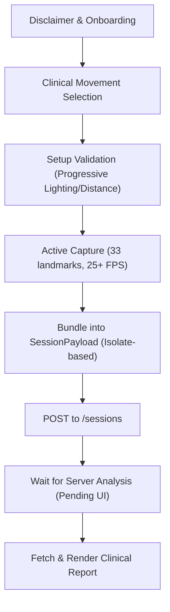

# DESIGN: AuraLink Mobile Hand-off Integration (Server-Centric)

## Overview
This modification aligns the AuraLink mobile app with the clinical research and server-side mandates established by Aaron (2026-04-11). The phone's role is refocused as a **high-fidelity capture tool** using MediaPipe BlazePose Full. Core biomechanical reasoning and MSI classification are migrated to the server to ensure clinical audibility and leverage advanced kinetics models (OpenCap Monocular).

## Detailed Analysis

### 1. Architectural Shift (Phone as Capture Tool)
- **Mandate:** "No chain reasoning on the phone. Everything else lives on the server."
- **Action:** Deprecate the local `ChainMapper` and `AngleCalculator` for final report generation. Retain a "light" version only for real-time user feedback (live skeleton and rep counting).
- **New Pipeline:** `Camera` → `PoseDetector` (MediaPipe BlazePose Full) → `SessionPayload` (33 landmarks) → `AuraLinkServer`.

### 2. Clinical Movement Alignment
- **Mandate:** Support the clinical priority list.
- **New Movement Set:**
  - `overhead_squat`
  - `single_leg_squat` (replaces singleLegBalance)
  - `push_up` (replaces overheadReach)
  - `rollup` (replaces forwardFold)

### 3. Data Model Adherence
- **Mandate:** Exact adherence to the server's Pydantic schema.
- **New Models:** Integrate `PoseLandmark`, `PoseFrame`, and `SessionPayload` from the handover package. Ensure exactly 33 landmarks are captured per frame.

### 4. Privacy & Disclaimer
- **Privacy Policy:** Maintain the "Privacy-First" claim by keeping raw video on-device. Landmarks are transmitted to the cloud for analysis.
- **Onboarding:** Retain the `DisclaimerView` as a legal shield and clinical context setter, but simplify the flow to reduce friction.

## Detailed Design

### Model Integration
- **`PoseDetector` (Interface):** Abstract class to decouple the UI from the ML backend.
- **`MediaPipePoseDetector` (Implementation):** Uses `google_mlkit_pose_detection` to produce 33-landmark `PoseFrame`s.
- **`AuraLinkClient` (Service):** New service to handle `POST /sessions` and `GET /reports`.

### Session Capture Flow (Mermaid)

## Summary
The integration transitions AuraLink from a "local prototype" to a "professional-grade clinical tool." By adopting the server-side logic backbone, we unlock joint moments, ground reaction forces, and MUSCLE force analysis that are impossible to calculate on-device today.

## References
- `docs/aaron's docs/2026-04-11-plan-changes-plain-english.md`
- `software/mobile-handover/README.md`
- `software/mobile-handover/interface/models.dart`
- Van Dillen et al. 2016 (MSI RCT)
- Harris-Hayes 2018 (Kinematic Correlation)
