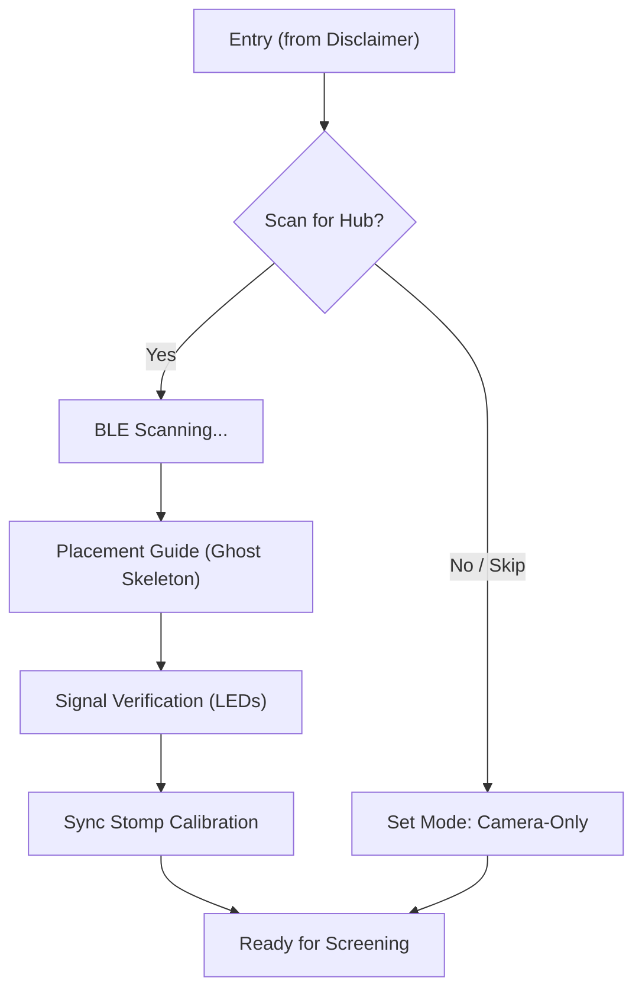

# DESIGN: Bioliminal Sensor Placement & Sync

## Overview
This modification introduces a mandatory (but skippable) hardware setup flow for Bioliminal. It ensures that the 10-channel sEMG sensors are correctly placed on the user's lower body and perfectly time-aligned with the BlazePose camera stream using a synchronized physical gesture.

## Detailed Analysis

### 1. The Setup Flow (Onboarding Phase)
- **Navigation:** Inserted after `DisclaimerView` and before the main Screening flow.
- **Optionality:** Users without the ESP32-S3 hub can tap "Skip / Use Camera Only" to proceed to the legacy prototype mode.
- **Persistence:** The choice (Hardware vs. Camera-Only) is persisted for the duration of the screening session.

### 2. Anatomical Placement (Ghost Skeleton)
- **Visuals:** A semi-transparent `HeatmapSkeleton` stands in a neutral pose.
- **Indicators:** 10 glowing target points pulse on the skeleton where electrodes should be attached (Gastroc, Soleus, VM, etc.).
- **Signal LEDs:** A vertical stack of 10 "LED" widgets next to the skeleton.
  - **Grey:** Lead disconnected (0V).
  - **Orange:** Signal saturated/pinned (3.3V/5V).
  - **Aqua:** Clean signal (Active range).

### 3. Hardware-to-Vision Sync (The Stomp)
- **Goal:** Align two disjoint data streams (BLE and Camera) to sub-10ms precision.
- **Mechanism:** The "Sync Stomp."
  - **Sensing:** The app watches for a sharp spike in the Calf sEMG channels.
  - **Vision:** The app watches for a sharp vertical acceleration (peak) in the Ankle/Foot landmarks.
  - **Fusion:** The time delta between these two peaks is used as the `sync_offset` for the remainder of the session.

## Detailed Design

### State Machine: Hardware Setup (Mermaid)

### Signal Quality Logic
| Voltage Level | Status | Visual |
| :--- | :--- | :--- |
| `~0V` | Lead Disconnected | Dim Grey LED |
| `0.5V - 3.0V` | Clean Signal | Bright Aqua LED |
| `> 3.1V` | Saturation/Error | Pulsing Orange LED |

## Alternatives Considered
- **Automatic IMU Sync:** (Rejected) Requires additional hardware complexity on the ESP32 side. The physical stomp is more intuitive for wellness users.
- **Manual Mapping:** (Rejected) Letting users map their own 10 channels is too high-friction. Standardized lower-body mapping is required for clinical integrity.

## Summary
The Sensor Placement & Sync module transforms Bioliminal from a "vision app" to a "multimodal clinical platform." It provides users with the confidence that their sensors are working and their data is accurately aligned, while maintaining a low-friction entry point for users without hardware.

## References
- Uhlrich et al. 2023 (EMG Biofeedback)
- `lib/core/services/hardware_controller.dart`
- `lib/features/camera/widgets/skeleton_overlay.dart`
